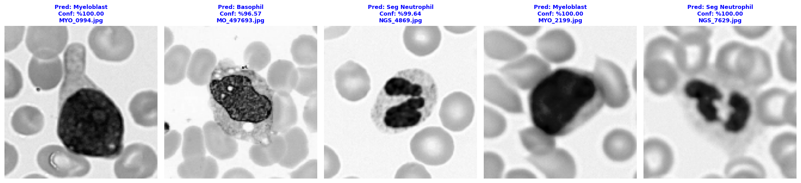
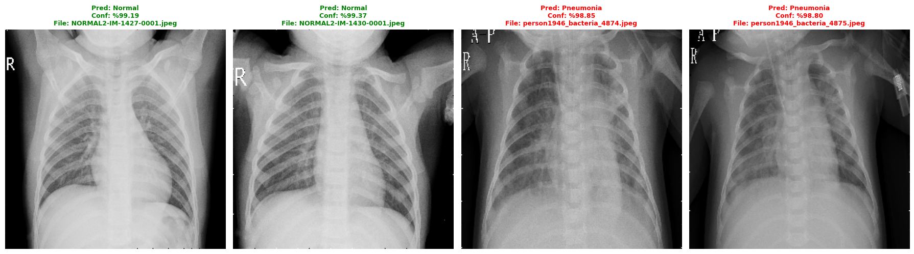

# AI-Powered Medical Image Analysis Suite

Hematoloji, nöroloji, oftalmoloji ve radyoloji alanlarında teşhis süreçlerini desteklemek amacıyla geliştirilmiş dört farklı derin öğrenme (CNN / U-Net) modelini içeren bir depo.

## 1. Problem

Tıbbi görüntülerin (mikroskop, MRI, fundus, röntgen) uzman bir hekim tarafından tek tek incelenmesi hem zaman alıcı hem de yoğun iş yükü altında hataya açık bir süreçtir. Bu proje, dört farklı tıbbi görüntüleme türü üzerinde çalışan derin öğrenme modelleri geliştirerek teşhis sürecine hızlı ve tutarlı bir ön değerlendirme katmanı eklemeyi amaçlar:

| # | Model | Problem | Test Doğruluğu |
|---|-------|---------|-----------------|
| 1 | **HemaDeep** | Mikroskobik kan hücresi görüntülerinden 5 sınıf kanser hücresi tespiti (basophil, erythroblast, monocyte, myeloblast, seg_neutrophil) | %99.07 |
| 2 | **Brain Tumor (U-Net)** | MRI taramalarından 4 sınıf beyin tümörü tespiti (glioma, meningioma, notumor, pituitary) | Val Acc %99.31 |
| 3 | **Diabetic Retinopathy** | Fundus fotoğraflarından diyabetik retinopati tespiti (DR / No DR) | %96 |
| 4 | **Pneumonia (U-Net)** | Göğüs röntgenlerinden zatürre tespiti (Normal / Pneumonia) | Val Acc %97.26 |

Bu modeller **tıbbi karar destek** amaçlıdır; kesin teşhis için uzman doktor onayı gereklidir.

## 2. Teknolojiler

- **Python 3.8+**
- **TensorFlow / Keras** — model mimarisi, eğitim ve çıkarım
- **segmentation-models** — U-Net (ResNet-34 backbone) mimarisi
- **scikit-learn** — veri bölme, metrikler (confusion matrix, classification report)
- **imbalanced-learn** — sınıf dengesizliği için oversampling
- **OpenCV / Pillow** — görüntü okuma ve ön işleme
- **NumPy & Pandas** — veri işleme
- **Matplotlib & Seaborn** — görselleştirme
- **kagglehub** — veri setlerinin otomatik indirilmesi

## 3. Kurulum

```bash
# Depoyu klonlayın
git clone <repo-url>
cd Yapay-Zeka-Modellerim

# Gerekli paketleri kurun
pip install tensorflow segmentation-models scikit-learn imbalanced-learn
pip install opencv-python pillow numpy pandas matplotlib seaborn kagglehub
```

> Kaggle veri setlerini indirebilmek için `kagglehub` bir Kaggle hesabı ile kimlik doğrulaması isteyebilir (`kagglehub.login()` veya `~/.kaggle/kaggle.json`).

Her model klasörü bağımsız çalışır ve iki betik içerir:

```bash
cd "Models/<Model Klasörü>"
python train.py     # Veri setini indirir, modeli eğitir ve kaydeder
python predict.py    # Kayıtlı modeli TEST/ klasöründeki görsellerle test eder
```

## 4. Özellikler

- Her model için **veri indirme → ön işleme → eğitim → değerlendirme → kayıt** adımlarını içeren, açıklamalı ve okunabilir `train.py` betikleri.
- Eğitilmiş modeli yükleyip `TEST/` klasöründeki örnek görüntüler üzerinde tahmin yapan, sonucu görselleştiren `predict.py` betikleri.
- Sınıf dengesizliği (Diabetic Retinopathy) için otomatik **oversampling**.
- Tıbbi görüntülere uygun, ölçülü **veri artırma (augmentation)** (küçük açı/kaydırma/parlaklık değişimleri).
- U-Net tabanlı modellerde (Brain Tumor, Pneumonia) **ResNet-34 omurgası** ile transfer öğrenme.
- Diabetic Retinopathy modelinde **MobileNetV2 omurgası + çok-başlı dikkat (multi-head attention)** katmanı.
- **EarlyStopping** ve **ReduceLROnPlateau** callback'leri ile aşırı öğrenmeyi (overfitting) önleyen eğitim döngüsü.
- Eğitim/doğrulama doğruluk-kayıp grafikleri, karışıklık matrisi (confusion matrix) ve sınıflandırma raporu üretimi.

### Örnek Tahmin Çıktıları

**HemaDeep — Kan Kanseri Tespiti**



**Brain Tumor — U-Net**


**Diabetic Retinopathy — MobileNetV2**


**Pneumonia — U-Net**



---

### Mimari Notları

U-Net mimarisi, "encoder-decoder" yapısı sayesinde tıbbi görüntü segmentasyonunda nesne sınırlarını belirlemede yüksek başarı sağlar. MobileNetV2 kullanımı ise modelin hızını optimize ederek düşük donanımlı cihazlarda da çalışabilmesine olanak tanır.

### Yasal Uyarı

Bu projede sunulan modeller tıbbi karar destek mekanizmalarıdır. Kesin teşhis için uzman doktor onayı gereklidir.

Bu proje MIT LICENSE ile lisanslanmıştır.
